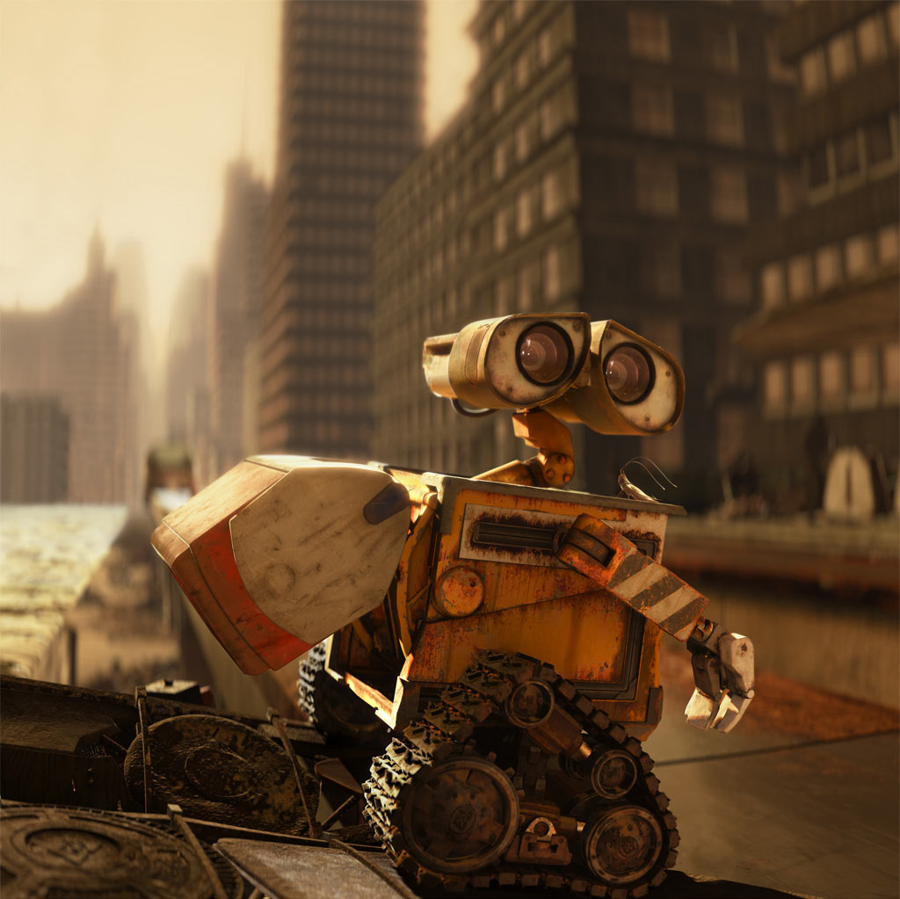

# Wallu Robot

Wallu es un robot manipulador y móvil diseñado para la selección de objetos reciclables/reutilizables. Es un robot autónomo capaz de realizar tareas de recolección y clasificación de objetos en diferentes categorías.

## Características

- Manipulador robótico para la selección de objetos reciclables/reutilizables.
- Capacidad de movimiento autónomo para navegar en el entorno.
- Reconocimiento de objetos utilizando imágenes capturadas por la cámara integrada.
- Reconocimiento de objetos impulsado por inteligencia artificial sin importar el tamaño, color, posición o perspectiva.
- Control tridimensional de la garra para un posicionamiento y agarre preciso de objetos.
- Navegación adaptativa al terreno, manteniendo una distancia segura de los objetos.
- Recolección secuencial por categorías, priorizando la recolección de una categoría antes de pasar a la siguiente.
- Comunicación de la recolección exitosa de todos los objetos en una categoría.

## Contenido del Repositorio

- `proyecto_wallu.py`: Archivo principal que contiene las clases e implementación del robot Wallu y sus componentes.
- `wallu.py`: Archivo de interfaz de usuario donde se pueden visualizar distintos estados del robot, así como iniciar y detener su funcionamiento.
- `main.py`: Directorio que contiene ejemplos de uso y scripts relacionados.
- `RobotStateMachi.py`: Archivo de Código de la máquina de estados.
- `requirements.txt`

## Uso

1. Clona este repositorio en tu máquina local.
2. Instala las dependencias requeridas.

# Files to be imported as additional source code  

- `Proyecto Wallu.py` [Class Diagram](https://app.genmymodel.com/api/projects/_K0Sx4P0bEe2JlLbgf0QSMg/diagrams/_K0Sx4_0bEe2JlLbgf0QSMg/svg)
- `Diagrama UML de la máquina de estados del robot`  [RobotStateMachine](https://app.genmymodel.com/api/projects/_UNeHUP2VEe2JlLbgf0QSMg/diagrams/_UNeHU_2VEe2JlLbgf0QSMg/svg)
